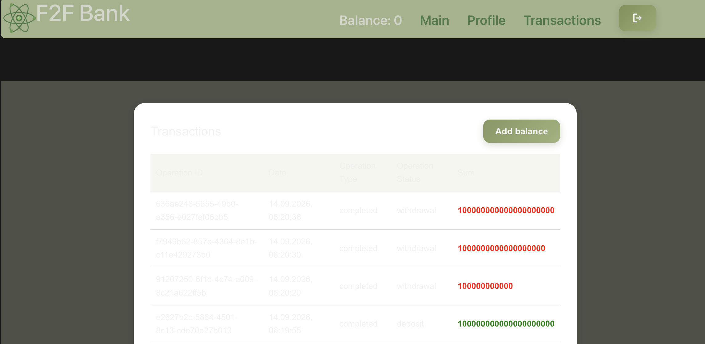
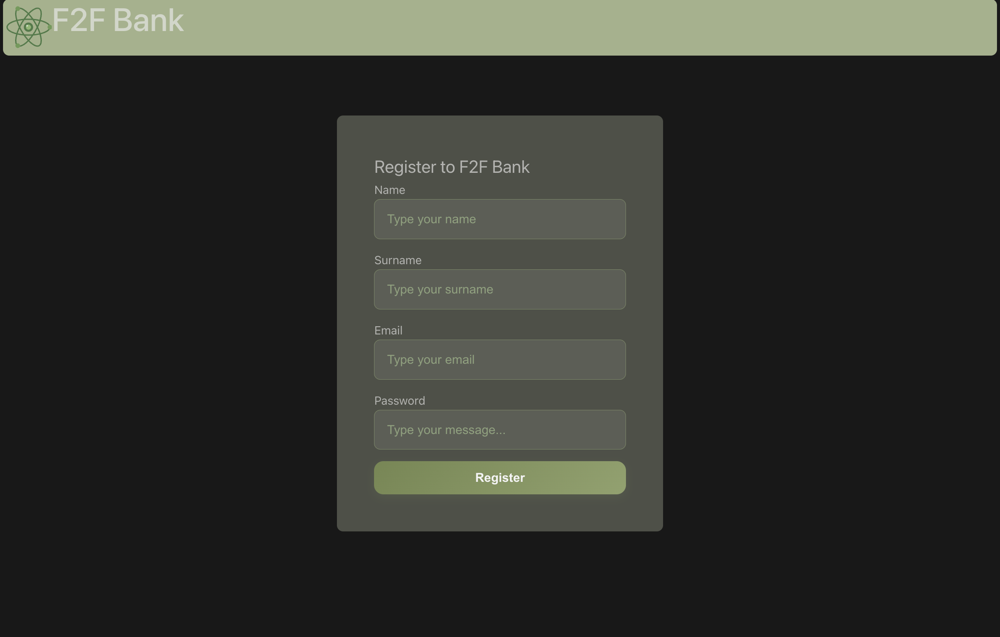

# Найденные баги и результаты тестирования

Перед тем как писать автотесты, я прошла приложение вручную и параллельно читала код — так нашлись почти все баги ниже. Здесь коротко фиксирую результат: что сломано, почему, и как я расставляла приоритеты.

## Методика приоритизации

Приоритет каждого сценария я считаю по формуле (по аналогии учили в университете на курсе тестирования):

```
P = (IC × 4) + (TI × 3)
```

- **IC — влияние на клиентов (вес 4 - потому что тут прямое измерение вреда пользователю):** 0 — незаметно; 1 — незначительная проблема; 2 — задет важный функционал, но есть обходной путь; 3 — критичный функционал, пользователь заблокирован в действиях.
- **TI — техническое влияние (вес 3 - на втором месте по сравнению с влияние на клиента, тут скорее косвенный, но также важный индикатор уже для сисстемного риска):** 0 — нет влияния; 1 — незначительная проблема; 2 — может вызвать проблемы при определённых условиях; 3 — существенно затрудняет работу системы; 4 — может привести к сбоям или рассогласованию данных.

**Классификация по P:** 0-9 — Низкий · 10-16 — Средний · 17-22 — Высокий · 23-27 — Критический.

## Подтверждённые баги, которые удалось выявить в ходе тестирвоания

### 1. Валидация номера телефона пропускает буквы
**Приоритет: Низкий** (IC=1, TI=1, P=7)

И на фронте (`HomeView.vue`), и на бэке (`user_service.py`) телефон проверяется так: сначала вырезаются все нецифровые символы (`phone.replace(/\D/g, '')`), потом проверяется только количество оставшихся цифр. Буквы внутри номера не отклоняются. Проверила переводом на `+7abc9991234567` — прошёл. Низкий приоритет, потому что результат ничем не отличается от перевода на "валидный" номер — получатель всё равно не проверяется (см. наблюдения ниже).

### 2. Регистрация не проверяет сложность пароля
**Приоритет: Средний** (IC=2, TI=1, P=11)

Ни на фронте, ни на бэке (`user.py`, `auth_service.py`) нет проверки длины или сложности пароля. Зарегистрировала пользователей с паролем `"1"` и с паролем из одних пробелов — оба раза успешно.

### 3. Длинные значения полей при регистрации дают 500 вместо ошибки валидации
**Приоритет: Высокий** (IC=3, TI=2, P=18)

Поле `name` в модели `UserCreate` не ограничено по длине, хотя в БД у него `varchar(50)`. Отправила имя на 300 символов — вместо понятной ошибки получила `500 Internal Server Error`: исключение от Postgres никто не перехватывает. Для сравнения, занятый email обрабатывается правильно — там `400` с внятным текстом.

### 4. В истории транзакций перепутаны колонки "Operation Type" и "Operation Status"
**Приоритет: Средний** (IC=2, TI=1, P=11)

В `TransactionsTable.vue` `<td>` идут не в том порядке, что `<th>` — под заголовком Operation Type рендерится `transactionStatus`, под Operation Status — `transactionType`. Сами данные верные, просто не в тех колонках.

### 5. Невалидный токен возвращает нестандартный ответ API
**Приоритет: Низкий** (IC=0, TI=1, P=3)

Запрос с невалидным токеном отдаёт `422` с телом `{"message": "Invalid Token", "error_type": "JWTDecodeError"}` — все остальные ошибки API идут в формате `{"detail": "..."}`. На пользователе это не сказывается: UI корректно редиректит на `/login`, проблему видно только в Network tab.

### 6. Двойной клик на "Отправить" в переводе приводит к двум списаниям
**Приоритет: Критический** (IC=3, TI=4, P=24)

Кнопка отправки блокируется через `:disabled="isLoading"`, но в `handleSubmit` нет проверки `if (isLoading.value) return`, а Vue применяет `disabled` в DOM асинхронно. Смоделировала синхронный двойной клик (`button.click(); button.click()` в одном тике) — ушли две отдельные транзакции списания вместо одной. Мышью кликнуть настолько быстро физически невозможно (пробовала сделать, но не вышло), поэтому при обычном ручном тестировании баг не проявляется — нашла его только когда писала автотест на race condition.

## Наблюдения (не баги, но стоит знать)

- Нет rate limiting на попытки входа.
- Email регистрозависим и при регистрации, и при входе — не баг, но неочевидно.
- Нет пагинации истории транзакций — при малом объёме не мешает, но может привести к проблемам в перспективе.
- Баланс хранится как `double precision` без верхнего лимита суммы — на очень больших числах возможна потеря точности (начинает писать числа по типу 1e+21, не считаю это проблемой для тестовой версии приложения, но для реального - это был бы уже баг).
- Редактирования профиля в приложении нет вообще — ни формы, ни эндпоинта.

## Что не понравилось в UX

### 1. На странице "Транзакции" текст почти невозможно проситать

Заголовки таблицы и содержимое ячеек (кроме Sum) почти сливаются с фоном.



Нашла причину: `.transactions__card` и `.transactions__table` используют захардкоженный белый фон, а цвет текста наследуется от `--color-text`, которая становится полупрозрачным светло-серым. Sum остаётся читаемым, потому что его цвет захардкожен отдельно. Это нарушение базовых требований к контрастности — часть пользователей физически не сможет прочитать свои транзакции.

### 2. Нет переключения языка интерфейса (EN/RU)

Весь интерфейс только на английском. Считаю, что возможность перевода улучшила бы пользовательский опыт и повысила бы доступность.

### 3. Заголовок "F2F Bank" в хедере не выровнен с остальными элементами


Нашла причину: `App.vue`: у `h1` стоит `position: relative; top: -10px`, что сдвигает заголовок вверх и перебивает `align-items: center` у остальных элементов хедера (может так и задумано, но решила подсветить этот момент =).

### 4. Со страницы регистрации нет ссылки "Назад ко входу"



Нашла причину: на `/login` есть ссылка на `/register`, обратной ссылки нет. Если пользователь случайно попал на регистрацию, но у него уже есть аккаунт, способы вернуться — нажать на "F2F Bank", или на стрелочку назад в браузере, ли менять урл ручками (для простых пользователей может быть не очевидно). Это проблема не только для обычного UX, но и для доступности.

---

# Результаты ручного тестирования

Полный отчет ручного тестирования — 47 сценариев по 7 разделам приложения.

ID распределяла следующим образом (так учили в университете на курсе тестирования): 
- **REG** — регистрация
- **LOG** — вход, **SES** — доступ и сессия
- **TRF** — перевод, **DEP** — пополнение баланса
- **TXN** — история транзакций
- **PRF** — профиль

## 1. Регистрация (`/register`)

| ID | Сценарий | Ожидаемый результат | Фактический результат | Статус | Приоритет |
|----|----------|---------------------|------------------------|--------|-----------|
| REG-01 | Успешная регистрация с валидными данными | Аккаунт создан, редирект | Аккаунт создан, редирект на `/login` | Пройден | Средний |
| REG-02 | Регистрация с уже занятым email | Ошибка | Валидная ошибка, регистрация блокируется | Пройден | Средний |
| REG-03 | Пустые обязательные поля | Форма не отправляется | Ошибка над пустым полем, регистрация не выполняется | Пройден | Низкий |
| REG-04 | Невалидный email (без `@`) | Ошибка валидации | Ошибка "указать корректный email" | Пройден | Низкий |
| REG-05 | Слабый/короткий пароль | Ожидалась что вылезит окно с критериями к паролю и попросит изменить пароль | Пароль `1` принят | Провален | Средний |
| REG-06 | Пароль из пробелов | Ожидалось отклонение | Принят | Провален | Средний |
| REG-07 | Очень длинные значения в полях | Корректная ошибка (400) | 500 Internal Server Error при превышении длины столбца БД (`varchar(50)` для name/email, `varchar(256)` для surname) | Провален | Высокий |
| REG-08 | HTML/скрипт-теги в имени | Запишет весь скрипт просто в имя пользовптелю | Alert не сработал, текст отображается как строка | Пройден | Средний |
| REG-09 | Email в разном регистре при регистрации и входе | Согласованность | Регистрация и вход одинаково регистрозависимы | Пройден | Низкий |
| REG-10 | Редирект после регистрации | Редирект на форму `/login` или главную страницу внутри приложения уже как авторизированный пользователь | Редирект на `/login` (авто-логина нет) | Пройден | Низкий |

## 2. Вход (`/login`)

| ID | Сценарий | Ожидаемый результат | Фактический результат | Статус | Приоритет |
|----|----------|---------------------|------------------------|--------|-----------|
| LOG-01 | Успешный вход | Редирект на `/`, токен в cookie | Подтверждено, `access_token` (JWT) в cookie | Пройден | Средний |
| LOG-02 | Неверный пароль | Ошибка, вход не выполнен | "Login failed", 401 | Пройден | Высокий |
| LOG-03 | Несуществующий email | Ошибка, вход не выполнен | "Login failed", 401 | Пройден | Высокий |
| LOG-04 | Пустые поля | Форма не отправляется | Ошибка "заполните поле", запрос не уходит | Пройден | Низкий |
| LOG-06 | Множественные попытки входа подряд | Ожидался rate limiting | Отсутствует — все попытки доходят до сервера, каждая получает 401 | Неоднозначно (Можно считать наверное пройденым, но я бы уточнила) | Средний |
| LOG-07 | Текст ошибки не "утекает" информацию (email не найден vs пароль неверный) | Обобщённая ошибка | Текст и код ответа одинаковы в обоих случаях ("Login failed", 401) — считаю корректным | Пройден | Низкий |

## 3. Доступ и сессия

| ID | Сценарий | Ожидаемый результат | Фактический результат | Статус | Приоритет |
|----|----------|---------------------|------------------------|--------|-----------|
| SES-01 | `/` без логина | Редирект на `/login` | Подтверждено | Пройден | Высокий |
| SES-02 | `/transactions` без логина | Редирект на `/login` | Подтверждено | Пройден | Высокий |
| SES-03 | `/profile` без логина | Редирект на `/login` | Подтверждено | Пройден | Высокий |
| SES-04 | F5 на защищённом экране | Сессия сохраняется | Подтверждено | Пройден | Средний |
| SES-05 | Логаут -> кнопка "назад" в браузере | Данные не видны повторно | Кратко показывается кэшированная страница, запрос данных возвращает 401, реальные данные не раскрываются | Неоднозначно (Можно считать наверное пройденымб ноя бы уточнила) | Низкий |
| SES-06 | Обращение к странице после простоя (истёкший токен) | Понятное сообщение + редирект на логин | Редирект на `/login` срабатывает корректно, но API отдаёт нетиповой сырой ответ `422 {"message": "Invalid Token", "error_type": "JWTDecodeError"}` вместо стандартного `{"detail": "..."}` | Провален | Низкий |

## 4. Главная / Перевод

| ID | Сценарий | Ожидаемый результат | Фактический результат | Статус | Приоритет |
|----|----------|---------------------|------------------------|--------|-----------|
| TRF-01 | Успешный перевод при достаточном балансе | Баланс уменьшается, транзакция создаётся | Подтверждено, "Transfer completed" | Пройден | Средний |
| TRF-02 | Телефон без `+` в начале | Ошибка валидации | Подтверждено | Пройден | Низкий |
| TRF-03 | Телефон короче 10 цифр (9 цифр) | Ошибка валидации | Подтверждено, ошибка про диапазон 10-15 | Пройден | Низкий |
| TRF-04 | Телефон ровно 10 цифр (граница) | Принимается | Подтверждено | Пройден | Низкий |
| TRF-05 | Телефон ровно 15 цифр (граница) | Принимается | Подтверждено | Пройден | Низкий |
| TRF-06 | Телефон длиннее 15 цифр (16 цифр) | Ошибка валидации | Подтверждено | Пройден | Низкий |
| TRF-07 | Телефон с буквами (`+7abc999...`) | Ожидалась ошибка | Перевод прошёл успешно — буквы молча вырезаются регэкспом при подсчёте цифр| Провален | Низкий |
| TRF-08 | Разные форматы телефона (пробелы, дефисы, скобки) | Все варианты принимаются одинаково | Подтверждено | Пройден | Низкий |
| TRF-09 | Сумма = 0 | Ошибка валидации | Подтверждено | Пройден | Низкий |
| TRF-10 | Сумма отрицательная | Ошибка валидации | Подтверждено | Пройден | Критический |
| TRF-11 | Сумма больше баланса | Ошибка, перевод не проходит | Подтверждено | Пройден | Критический |
| TRF-12 | Нечисловой ввод в поле суммы | Поле не принимает | Подтверждено | Пройден | Низкий |
| TRF-13 | Двойной быстрый клик на "Отправить" | Перевод выполняется один раз | При обычном клике мышью выглядит защищённым, но при программном синхронном двойном клике создаются две отдельные транзакции списания — реальной защиты от race condition на уровне кода нет | Провален | Критический |
| TRF-14 | Пустое поле (телефон/сумма/назначение) | Форма не отправляется | Подтверждено для всех трёх полей | Пройден | Низкий |

## 5. Пополнение баланса

| ID | Сценарий | Ожидаемый результат | Фактический результат | Статус | Приоритет |
|----|----------|---------------------|------------------------|--------|-----------|
| DEP-01 | Успешное пополнение валидной суммой | Баланс увеличивается | Подтверждено | Пройден | Средний |
| DEP-02 | Сумма = 0 | Не даёт пополнить | Пополнение не выполняется | Пройден | Низкий |
| DEP-03 | Сумма отрицательная | Не даёт пополнить | Пополнение не выполняется | Пройден | Критический |
| DEP-04 | Нечисловой ввод | Поле не принимает | Подтверждено, только цифры | Пройден | Низкий |
| DEP-05 | Очень большая сумма | Корректная обработка без краша | Работает, суммы отображаются верно (но при очень больших ссумах в какой-то мент начинает отображать число так - 1e+21, писала про это выше) | Пройден | Средний |

## 6. История транзакций

| ID | Сценарий | Ожидаемый результат | Фактический результат | Статус | Приоритет |
|----|----------|---------------------|------------------------|--------|-----------|
| TXN-01 | Новая транзакция появляется в списке сразу | Отображается без перезагрузки | Подтверждено | Пройден | Низкий |
| TXN-02 | Корректность отображаемых данных | Данные в верных колонках | Колонки "Operation Type" и "Operation Status" перепутаны местами | Провален | Средний |
| TXN-03 | Сортировка от новых к старым | Порядок соблюдается | Подтверждено | Пройден | Низкий |
| TXN-04 | Пустой список у нового пользователя | Осмысленная заглушка | "No transactions yet" | Пройден | Низкий |
| TXN-05 | Пагинация/скролл при большом числе транзакций | Работает корректно | Пагинации нет — рендерится всё сразу | Неоднозначно (Можно считать наверное пройденымб ноя бы уточнила) | Средний |

## 7. Профиль

| ID | Сценарий | Ожидаемый результат | Фактический результат | Статус | Приоритет |
|----|----------|---------------------|------------------------|--------|-----------|
| PRF-01 | Корректность отображения имени/фамилии/email | Совпадает с данными при регистрации | Подтверждено | Пройден | Низкий |
